# THE ADVENTURE PLAN

The Adventure Plan is my **personal travel blog** website to help people get ideas for their next holidays. The site will target people who love traveling and are looking for tips and recommendations for a travel which combines historical places to visit with places to relax. It will be *useful for people who need help planning holidays, as they could also get into contact for a more personal approach*.

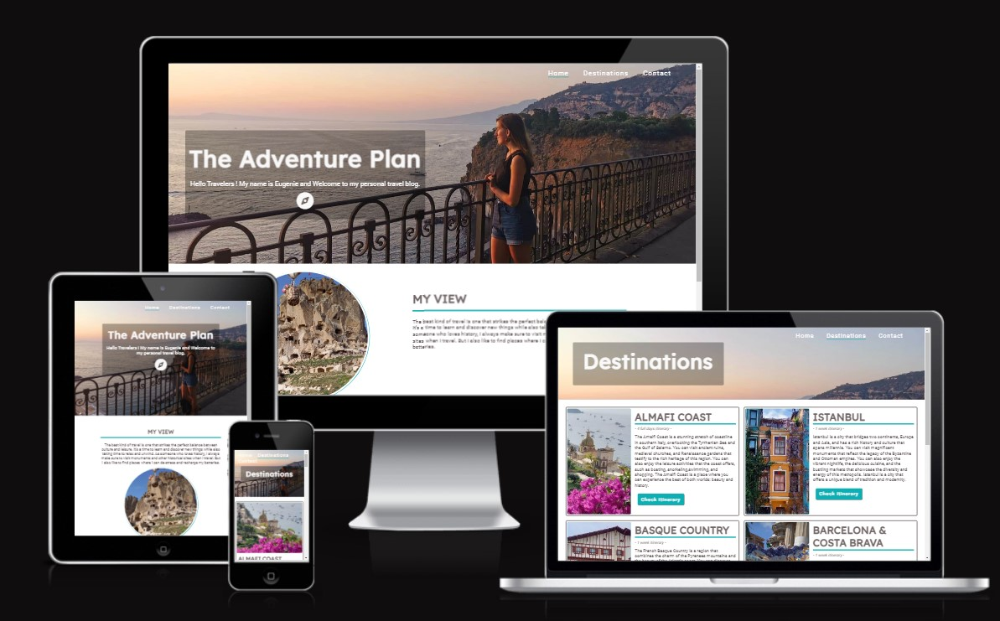

Project url : [The Adventure Plan](https://shiimymy.github.io/The-Adventure-Plan/)

## Features

### Existing Features

#### Navigation Bar

The Navigation bar can be found on the three pages. It is responsive and include links to the Home page, the Destinations page and the Contact page. This make it easier to navigate between the pages.
Also the active page is underlined in the branding color for better navigation understanding.

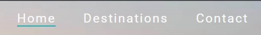

#### Hero Section

The hero section is the section the user will see first when landing on the page. It includes a personnal picture and content with the first heading fully responsive.
For more visibility, the content has a transparent dark backgroung and written in white. Then, the first heading has an animation on load taken from a library and a logo was included to be eye catching.

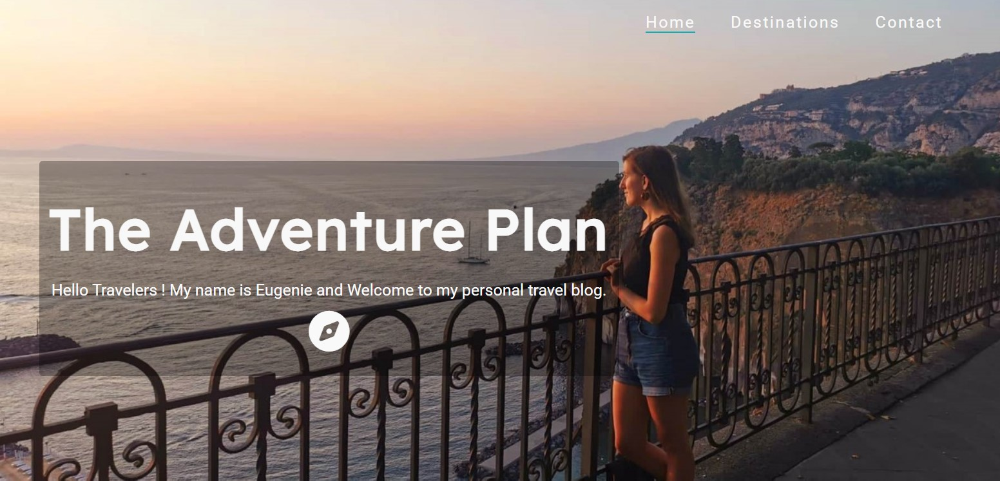

#### My View Section

My view section exposes what I am looking for when travelling for the website visitors to know what to expect from it : **History and leasure**. 
It includes a picture of a castle of one of my trips which align with the content. When the screen size is reduce, the responsivness make the picture on the left goes below the content.

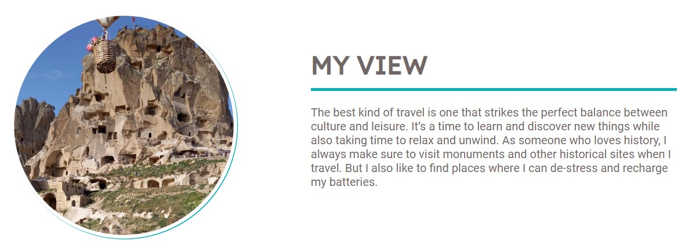

#### About section

The About section gives a list of the main goals of the website to highlight its purpose. The section is devide in two parts : 
- the left is whith a heading and a small introductory sentence,
- the right is the list of goals with a background picture to keep attracting the user in the reading and make them curious.  
This section is also responsive and the right section on a full screen will go below the section heading on a small screen.

#### The Footer

The footer can be found at the bottom of all three pages. It includes the social media links and a button to invite visitors to the contact page. The user will then choose its prefer method of contact.

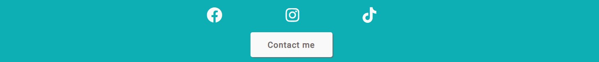

#### Destinations

The destinations page is the second page of the website. It is where the user will be able to see six differents destinations at the moment. They will be able to see a picture that illustrate each one of them with content that introduce them. 
The content is created to align with My view section in the first page. A button is aslo included to each destinations to check a recommanded itinerary *(coming soon)*.

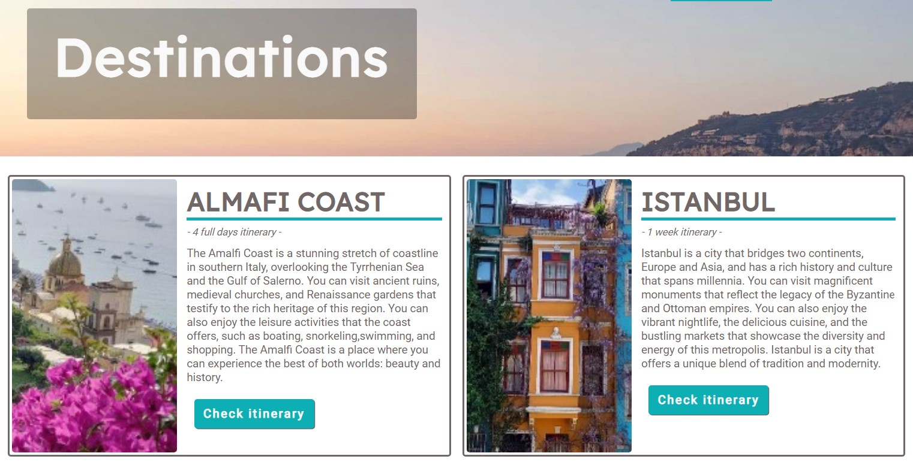

#### Contact page

The contact page has a form included for user who would like to have a personnalised travel plan. They can provide minimum information to get in touch but also an idea of what they are expecting : destination and travel duration.
Once the form sent, a thank you message will appear to confirm that the form has been sent.The user will be asked to complete all input to be able to send the form. 

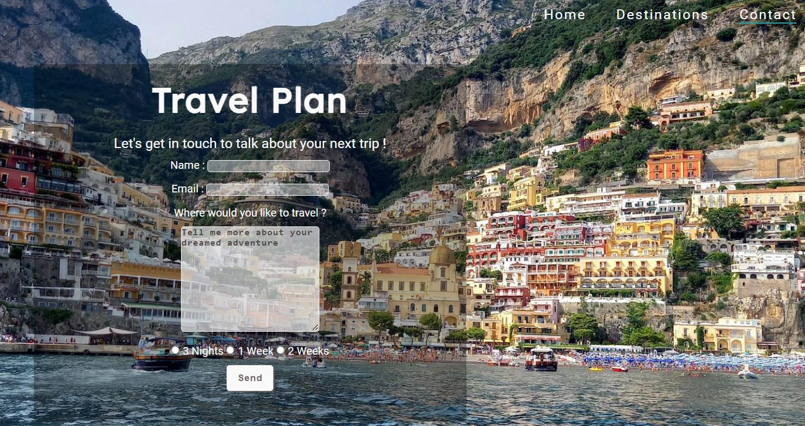

### Features Left to Implement

The next features will be to create a page for each itinerary buttons. Each page would have the same struture than the other page : navigation bar, main heading and footer. 
For each destination page, we would find an itinerary with Historical sites to visit, where to relax and food to try.

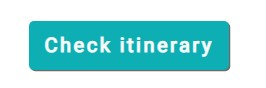

## Testing

### Manual Testing 

I checked first and confirmed that the website was working on different browsers : Google Chrome, Microsoft Edge and Firefox.

Through Manual testing I check all the links and I could realised that the socials links were not working. I discovered that I forgot the "https://" at the begining of each url and fixed them afterward.

I manualy check if the responsivness was working and if it was smooth enough.
For media query, I made some changes after testing and adapt the css of the contact page and the footer links.

### Validator Testing

 - HTML Testing : 
  Errors found with [W3C Validator](https://validator.w3.org/#validate_by_input) in all buttons as I used an anchor tag as parent element. All buttons elements were deleted and I styled the anchor element to look like a button.
  There was also paragraph endiing tags on there own which were deleted.
  
- CSS Testing : 
  No error returned found when passing through the official [Jigsaw Validator](https://jigsaw.w3.org/css-validator/).

### Unfix responsivness

I left for the moment the unresponsivness of the contact.html page for some tablets due to time but I will add it in the future.

### Performance Testing

I used [Lighthouse](https://developer.chrome.com/docs/lighthouse/overview/) to test the performances of my 4 pages. The results were positive as scores are between 76 and 90. Please find the result below at the time the tests : 

- index page performances : 
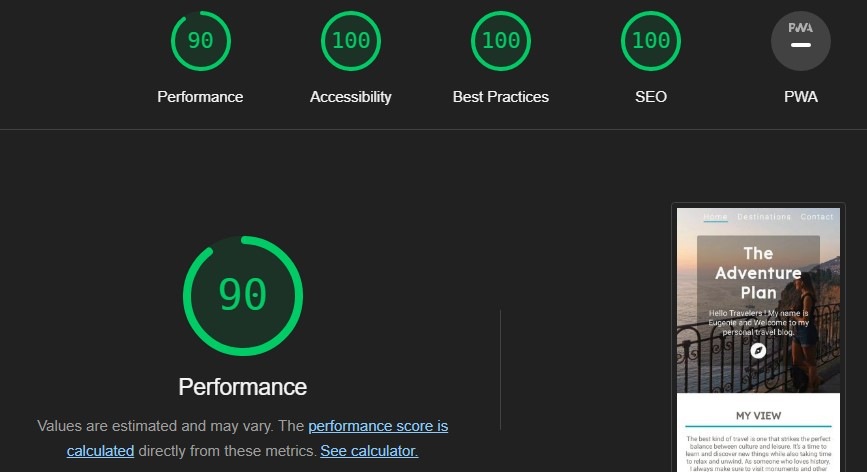
- destinations page performances : 
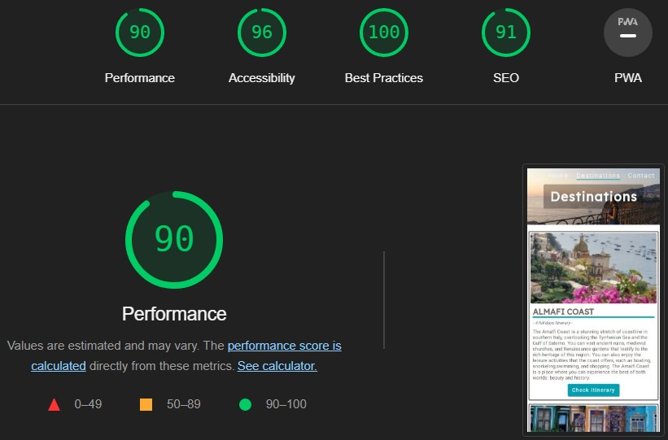
- contact page performances : 
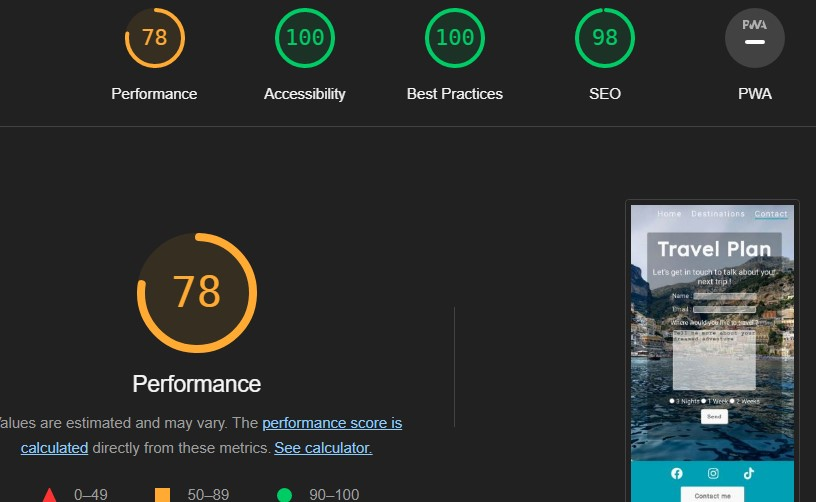
- thanks page performances : 
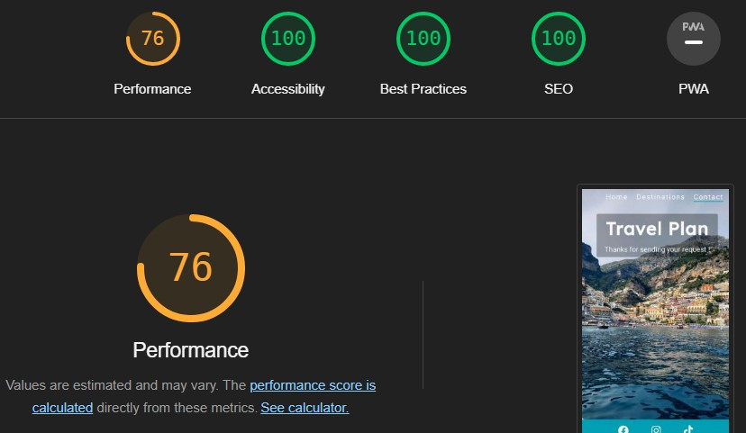

## Deployment

- Fork template
The first step before coding was to fork the [ci-full-template](https://github.com/Code-Institute-Org/ci-full-template) from [Code Institute](https://codeinstitute.net/) as asked. To do so, once on the ci-full-template in Github *(as per first link)*, I cliked on **Fork** on the top-right of the page. Then I renamed the repositorie with the name of my project under **Repository name** and clicked to **Create Fork**. This allowed me to update the template.

- Project deployment
Once the site nearly ready, it was deployed thanks to [Github](https://github.com/) from the [The-Adventure-Plan repositorie](https://github.com/Shiimymy/The-Adventure-Plan).
Once in the repositorie, I cliked on **Settings** in the top navigation bar then on **Pages** in the left menu. Once the page opened, in the **Branch** section, I choose in the drop down menu **main** and clicked on **Save**.

- Clone project 

This project will be also cloned to work localy on the future realesed by following this setps :
1. Go in [The Adventure Plan repositorie](https://github.com/Shiimymy/The-Adventure-Plan),
2. Click on Code to find the url and copy it.
3. In the Terminal write *git clone* and paste the url.
4. Press Enter to create the clone.

## Credits

### Content

- The social-medias icons and the compass icons were taken from [Font Awesome](https://fontawesome.com/).
- The header animation in index.html was taken from [Animate.css](https://animate.style/).

### Media

All pictures where taken during my trips as I want to display my own experience in this website0