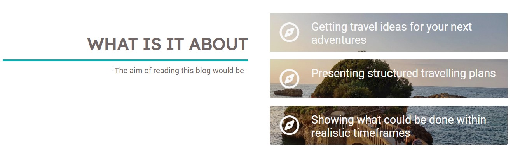

# THE ADVENTURE PLAN

The Adventure Plan is a personal travel blog to help people get ideas for their next holidays. The site will target people who love traveling and are looking for tips and recommendations for a travel which combines historical places to visit with places to relax. It will be useful for people who need help planning holidays, as they could also get into contact for a more personal approach.

Project url : https://shiimymy.github.io/The-Adventure-Plan/

## Features

### Existing Features

#### Navigation Bar

#### Hero Section

#### My View Section

#### About section

#### The Footer

#### Destinations

#### Contact page

### Features Left to Implement
Another feature idea

## Testing

### Manual Testing 

links 
media query 

### Validator Testing
HTML

CSS

### Fix Bug

social-links

## Deployment

how was it dep : steps
clone project in terminal "git clone url" : steps
fork repo : describe steps 

## Credits

### Content

### Media
